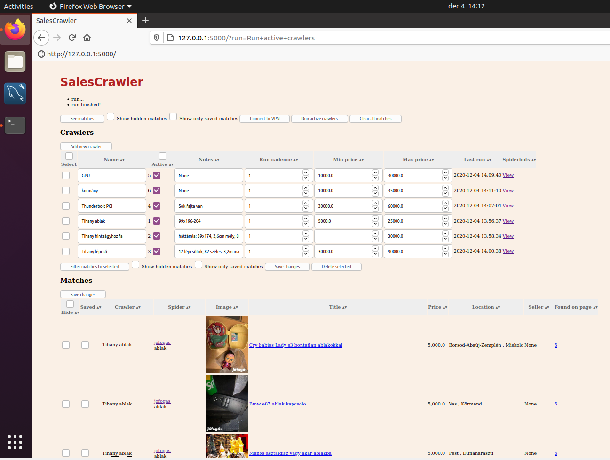
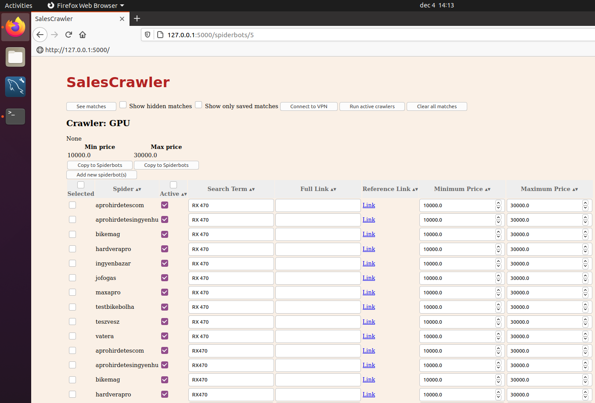

# About
Backend, WebGUI and some custom spiders to host regular searches of scrapy spiders. User can hide matches to avoid repeative checks of same found items.

## Features
- Webserver to provide webGUI on local machine
- Store found matches in MySQL database
- Crawlers: a set of spiders for a specific item with min/max price and notes
- Spiderbots: Crawdy spiders with specific item to search or direct url for searchpage

- Matches: can be hidden or saved as favorites. 

[See progress here](https://github.com/otapi/salescrawler/projects/1)

## Install
- Python3 is required
- Follow/run [install_VM.sh](install_VM.sh)
